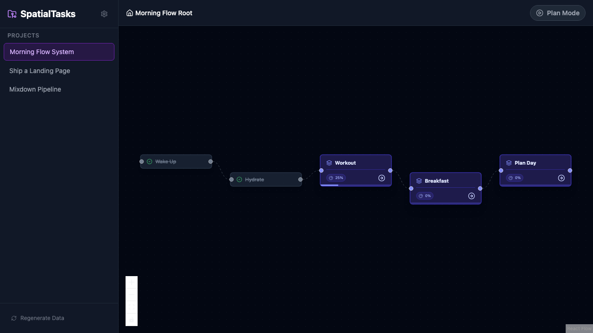

# SpatialTasks

A spatial, node-based task management system. Organize projects as connected nodes on a canvas, open nodes into nested subflows, and navigate through work visually.



## Features

### Core

- **Spatial Canvas** — Drag-and-drop nodes on an infinite canvas with pan and zoom
- **Nested Subflows** — Open container nodes to dive into nested workspaces with breadcrumb navigation
- **Dependency Tracking** — Edges between nodes enforce task ordering; blocked nodes are visually indicated
- **Visual Progress** — Track completion with progress rings, status indicators, and progress bars on containers
- **Execution Mode** — Highlights actionable next steps, dims completed/blocked work, and provides a "Next" button to advance through your flow
- **Resizable Nodes** — Drag the right edge of any node to resize it
- **List View** — Toggle between spatial graph view and a flat list view for quick scanning
- **Node Notes** — Attach notes to any node with copy-to-clipboard and full-screen expand support
- **Undo / Redo** — Full undo/redo history (Ctrl+Z / Ctrl+Shift+Z)
- **Persistent State** — All work is saved locally in the browser with a live save indicator

### Markdown Plan Import

- **Import Implementation Plans** — Upload a `.md` / `.txt` file or paste markdown to auto-generate a project graph from your plan
- **Smart Parsing** — `## Headings` become steps (container nodes), bullet lists become substeps (action nodes), and `### Verification` sections are preserved
- **Description & Notes** — Step descriptions from the markdown are stored in each node's notes for reference during execution
- **Review Before Creating** — Parsed plans open in the interactive draft review panel where you can rename, reorder, indent/outdent, and add/remove steps before committing to canvas
- **File Drop Zone** — Drag-and-drop file upload with paste-markdown fallback tab

### Enhanced Execution Mode

- **Step Detail Panel** — When executing inside a step's subgraph, a floating panel shows the step description, substep checklist, and verification criteria
- **Inline Substep Checklist** — Click any substep in the panel to cycle its status (todo → in progress → done) without leaving the panel
- **Verification Criteria** — Collapsible verification section (parsed from `### Verification` in the imported markdown) displayed in an amber-accented box
- **Complete & Move On** — One-click button to mark all remaining substeps as done, navigate back to the parent graph, and auto-advance to the next step
- **Collapsible Panel** — Panel can be collapsed to a slim tab on the right edge; responsive bottom-sheet layout on mobile

### AI Features

- **Magic Expand** — Use your own Gemini API key to auto-decompose container nodes into subtask subflows with dependencies
- **AI Starter Flows** — Generate a complete project flow from a description using AI when starting a new project

### Project Management

- **Multiple Projects** — Create, switch between, and delete projects from the sidebar
- **New Project Button** — Quick-create projects from the sidebar

### iPhone & Mobile

- **Touch-Optimized** — 44pt minimum touch targets, long-press context menus, floating action button for quick task creation
- **Tap-to-Connect** — Create edges between nodes by tapping source then target in connect mode
- **Tap-to-Zoom** — Tapping a node auto-zooms to show it and its immediate successors
- **View Full Flow** — Floating button to zoom out and see the entire diagram at once
- **Swipe-to-Navigate** — Swipe right from the left edge to go back up the breadcrumb
- **Responsive Header** — View toggle and secondary actions collapse into an overflow menu on small screens
- **Haptic Feedback** — Subtle vibration on status changes and navigation
- **iOS Safe Areas** — Proper insets for notch, home indicator, and virtual keyboard
- **Slide-Over Sidebar** — Sidebar renders as a drawer overlay on mobile
- **Pinch-to-Zoom Preferred** — Canvas zoom controls are hidden on mobile in favor of native gestures

## Tech Stack

- React 18 + TypeScript
- ReactFlow (node-flow canvas)
- Zustand (state management with localStorage persistence + undo/redo via zundo)
- Tailwind CSS
- Vite

## Getting Started

```bash
npm install
npm run dev
```

## Gemini AI Setup (Optional)

SpatialTasks supports optional AI features that use Google's Gemini 2.5 Flash. This is a bring-your-own-key (BYOK) feature — no API key is required for core functionality.

### Step 1: Get a Gemini API Key

1. Go to [Google AI Studio](https://aistudio.google.com/apikey)
2. Sign in with your Google account
3. Click **Create API Key**
4. Select or create a Google Cloud project when prompted
5. Copy the generated API key

> Google offers a free tier for Gemini API usage. Limits vary by model and tier — check [Google's pricing page](https://ai.google.dev/pricing) for current details.

### Step 2: Add the Key to SpatialTasks

1. Open SpatialTasks in your browser
2. Click the **gear icon** in the top-left sidebar header
3. Paste your API key into the input field
4. Click **Save Key**
5. The status indicator will turn green showing "Key configured"

### Step 3: Use Magic Expand

1. Navigate to any project with container nodes (the purple nodes with a layer icon)
2. A **sparkle icon** will now appear on each container node next to the enter arrow
3. Click the sparkle icon on a container node
4. Gemini will generate 3–7 subtasks with dependencies and wire them into a nested subflow
5. The app automatically navigates into the new subgraph

### Troubleshooting

| Issue | Solution |
|-------|----------|
| No sparkle button visible | Open Settings and verify your key is saved (green status dot) |
| "Invalid API key" error | Double-check the key in Settings; regenerate it in AI Studio if needed |
| "Quota exceeded" error | You've hit your Gemini free-tier limit — wait or upgrade your plan |
| "Network error" | Check your internet connection and try again |

### Removing or Replacing Your Key

Open Settings (gear icon) and click **Remove** to delete your key, or paste a new one and click **Save Key** to replace it. Your key is stored locally in your browser's localStorage and is only sent to Google's Gemini API endpoint.

## Deployment

Configured for Vercel. Push to deploy or run:

```bash
npm run build
```
